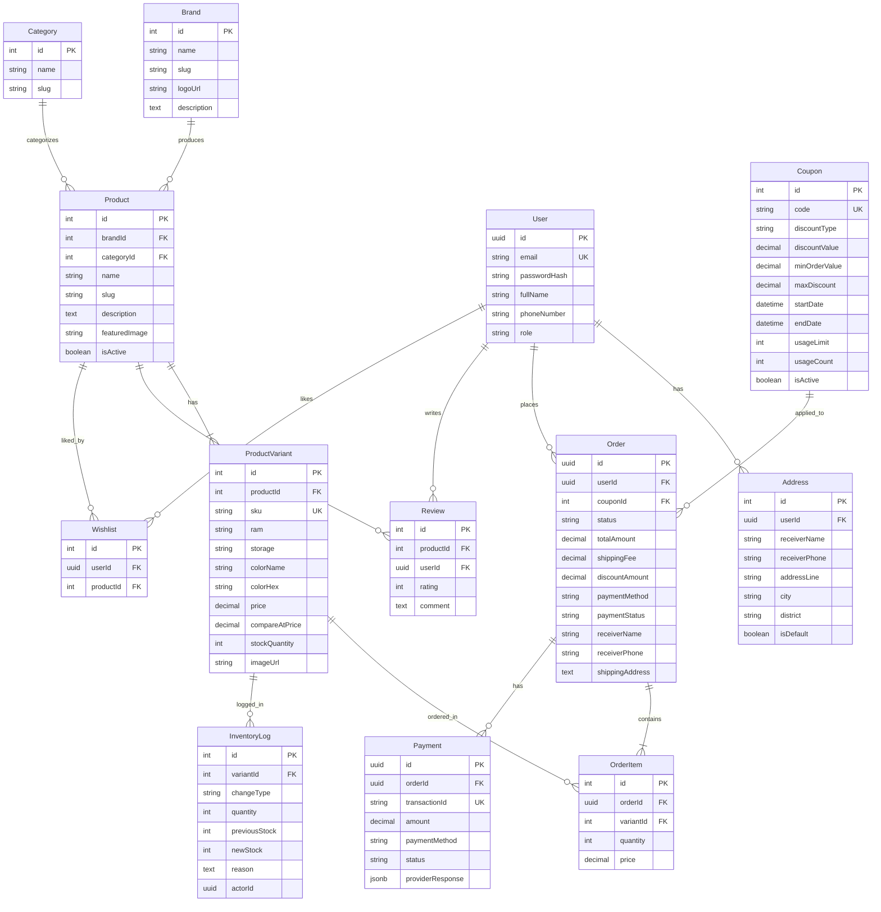

# Kế hoạch Thiết kế Cơ sở Dữ liệu PostgreSQL kết hợp Prisma ORM

Tài liệu này nâng cấp bản thiết kế cơ sở dữ liệu PostgreSQL sang sử dụng **Prisma ORM** (Object-Relational Mapping). Prisma giúp quản lý Schema tập trung, tự động hóa quá trình di cư dữ liệu (Migrations), và tự động tạo mã nguồn TypeScript/JavaScript Client an toàn (type-safe) để truy vấn dữ liệu điện thoại hiệu quả.

---

## 1. Sơ đồ Thực thể Mối quan hệ (Entity-Relationship)

Dưới đây là sơ đồ quan hệ thực thể (ERD) đã được bổ sung 3 bảng mới: **Wishlist**, **Coupon**, và **InventoryLog** để đồng bộ 100% với các tính năng REST API mở rộng:



---

## 2. File Cấu hình Prisma Schema (`schema.prisma`)

```prisma
datasource db {
  provider = "postgresql"
  url      = env("DATABASE_URL")
}

generator client {
  provider = "prisma-client-js"
}

// 1. Hãng sản xuất (Apple, Samsung, Xiaomi...)
model Brand {
  id          Int       @id @default(autoincrement())
  name        String    @db.VarChar(100)
  slug        String    @unique @db.VarChar(100)
  logoUrl     String?   @map("logo_url") @db.VarChar(255)
  description String?   @db.Text
  products    Product[]
  createdAt   DateTime  @default(now()) @map("created_at")
  updatedAt   DateTime  @updatedAt @map("updated_at")

  @@map("brands")
}

// 2. Danh mục sản phẩm (Smartphones, Tablets, Accessories...)
model Category {
  id        Int       @id @default(autoincrement())
  name      String    @db.VarChar(100)
  slug      String    @unique @db.VarChar(100)
  products  Product[]
  createdAt DateTime  @default(now()) @map("created_at")

  @@map("categories")
}

// 3. Sản phẩm chung (Ví dụ: iPhone 16 Pro Max)
model Product {
  id            Int              @id @default(autoincrement())
  brandId       Int              @map("brand_id")
  brand         Brand            @relation(fields: [brandId], references: [id], onDelete: Restrict)
  categoryId    Int?             @map("category_id")
  category      Category?        @relation(fields: [categoryId], references: [id], onDelete: SetNull)
  name          String           @db.VarChar(150)
  slug          String           @unique @db.VarChar(150)
  description   String?          @db.Text
  featuredImage String?          @map("featured_image") @db.VarChar(255)
  isActive      Boolean          @default(true) @map("is_active")
  variants      ProductVariant[]
  reviews       Review[]
  wishlists     Wishlist[]
  createdAt     DateTime         @default(now()) @map("created_at")
  updatedAt     DateTime         @updatedAt @map("updated_at")

  @@index([brandId])
  @@map("products")
}

// 4. Biến thể sản phẩm (Phân loại theo RAM, Storage, Color)
model ProductVariant {
  id              Int            @id @default(autoincrement())
  productId       Int            @map("product_id")
  product         Product        @relation(fields: [productId], references: [id], onDelete: Cascade)
  sku             String         @unique @db.VarChar(50)
  ram             String?        @db.VarChar(20) // Ví dụ: 8GB, 12GB
  storage         String?        @db.VarChar(20) // Ví dụ: 256GB, 512GB
  colorName       String?        @map("color_name") @db.VarChar(50)
  colorHex        String?        @map("color_hex") @db.VarChar(7)
  price           Decimal        @db.Decimal(12, 2)
  compareAtPrice  Decimal?       @map("compare_at_price") @db.Decimal(12, 2)
  stockQuantity   Int            @default(0) @map("stock_quantity")
  imageUrl        String?        @map("image_url") @db.VarChar(255)
  orderItems      OrderItem[]
  inventoryLogs   InventoryLog[]
  createdAt       DateTime       @default(now()) @map("created_at")
  updatedAt       DateTime       @updatedAt @map("updated_at")

  @@index([productId])
  @@map("product_variants")
}

// 5. Người dùng (Users)
model User {
  id           String     @id @default(uuid()) @db.Uuid
  email        String     @unique @db.VarChar(150)
  passwordHash String     @map("password_hash") @db.VarChar(255)
  fullName     String     @map("full_name") @db.VarChar(100)
  phoneNumber  String?    @map("phone_number") @db.VarChar(20)
  role         String     @default("user") @db.VarChar(20)
  addresses    Address[]
  orders       Order[]
  reviews      Review[]
  wishlists    Wishlist[]
  createdAt    DateTime   @default(now()) @map("created_at")
  updatedAt    DateTime   @updatedAt @map("updated_at")

  @@map("users")
}

// 6. Địa chỉ giao hàng
model Address {
  id            Int     @id @default(autoincrement())
  userId        String  @map("user_id") @db.Uuid
  user          User    @relation(fields: [userId], references: [id], onDelete: Cascade)
  receiverName  String  @map("receiver_name") @db.VarChar(100)
  receiverPhone String  @map("receiver_phone") @db.VarChar(20)
  addressLine   String  @map("address_line") @db.VarChar(255)
  city          String  @db.VarChar(100)
  district      String  @db.VarChar(100)
  isDefault     Boolean @default(false) @map("is_default")

  @@map("addresses")
}

// 7. Đơn hàng (Orders)
model Order {
  id              String      @id @default(uuid()) @db.Uuid
  userId          String?     @map("user_id") @db.Uuid
  user            User?       @relation(fields: [userId], references: [id], onDelete: SetNull)
  couponId        Int?        @map("coupon_id")
  coupon          Coupon?     @relation(fields: [couponId], references: [id], onDelete: SetNull)
  status          String      @default("pending") @db.VarChar(30) // pending, confirmed, shipping, completed, cancelled
  totalAmount     Decimal     @map("total_amount") @db.Decimal(12, 2)
  shippingFee     Decimal     @default(0.00) @map("shipping_fee") @db.Decimal(12, 2)
  discountAmount  Decimal     @default(0.00) @map("discount_amount") @db.Decimal(12, 2)
  paymentMethod   String      @map("payment_method") @db.VarChar(50)
  paymentStatus   String      @default("pending") @map("payment_status") @db.VarChar(30)
  receiverName    String      @map("receiver_name") @db.VarChar(100)
  receiverPhone   String      @map("receiver_phone") @db.VarChar(20)
  shippingAddress String      @map("shipping_address") @db.Text
  orderItems      OrderItem[]
  payments        Payment[]
  createdAt       DateTime    @default(now()) @map("created_at")
  updatedAt       DateTime    @updatedAt @map("updated_at")

  @@index([userId])
  @@index([couponId])
  @@map("orders")
}

// 8. Chi tiết đơn hàng (Order Items)
model OrderItem {
  id        Int            @id @default(autoincrement())
  orderId   String         @map("order_id") @db.Uuid
  order     Order          @relation(fields: [orderId], references: [id], onDelete: Cascade)
  variantId Int            @map("variant_id")
  variant   ProductVariant @relation(fields: [variantId], references: [id], onDelete: Restrict)
  quantity  Int
  price     Decimal        @db.Decimal(12, 2)

  @@map("order_items")
}

// 9. Đánh giá (Reviews)
model Review {
  id        Int      @id @default(autoincrement())
  productId Int      @map("product_id")
  product   Product  @relation(fields: [productId], references: [id], onDelete: Cascade)
  userId    String   @map("user_id") @db.Uuid
  user      User     @relation(fields: [userId], references: [id], onDelete: Cascade)
  rating    Int      @db.Integer
  comment   String?  @db.Text
  createdAt DateTime @default(now()) @map("created_at")

  @@map("reviews")
}

// 10. Giao dịch thanh toán (Payments)
model Payment {
  id               String   @id @default(uuid()) @db.Uuid
  orderId          String   @map("order_id") @db.Uuid
  order            Order    @relation(fields: [orderId], references: [id], onDelete: Cascade)
  transactionId    String?  @unique @map("transaction_id") @db.VarChar(100)
  amount           Decimal  @db.Decimal(12, 2)
  paymentMethod    String   @map("payment_method") @db.VarChar(50)
  status           String   @default("pending") @db.VarChar(30)
  providerResponse Json?    @map("provider_response") @db.JsonB
  createdAt        DateTime @default(now()) @map("created_at")
  updatedAt        DateTime @updatedAt @map("updated_at")

  @@index([orderId])
  @@index([transactionId])
  @@map("payments")
}

// ================= BỔ SUNG ĐỒNG BỘ VỚI API MỚI =================

// 11. Danh sách yêu thích (Wishlist)
model Wishlist {
  id        Int      @id @default(autoincrement())
  userId    String   @map("user_id") @db.Uuid
  user      User     @relation(fields: [userId], references: [id], onDelete: Cascade)
  productId Int      @map("product_id")
  product   Product  @relation(fields: [productId], references: [id], onDelete: Cascade)
  createdAt DateTime @default(now()) @map("created_at")

  @@unique([userId, productId]) // Tránh người dùng thích trùng lặp sản phẩm
  @@map("wishlists")
}

// 12. Mã giảm giá (Coupons)
model Coupon {
  id            Int      @id @default(autoincrement())
  code          String   @unique @db.VarChar(50)
  discountType  String   @map("discount_type") @db.VarChar(20) // percentage hoặc fixed
  discountValue Decimal  @map("discount_value") @db.Decimal(12, 2)
  minOrderValue Decimal? @map("min_order_value") @db.Decimal(12, 2)
  maxDiscount   Decimal? @map("max_discount") @db.Decimal(12, 2)
  startDate     DateTime @map("start_date")
  endDate       DateTime @map("end_date")
  usageLimit    Int?     @map("usage_limit")
  usageCount    Int      @default(0) @map("usage_count")
  isActive      Boolean  @default(true) @map("is_active")
  orders        Order[]
  createdAt     DateTime @default(now()) @map("created_at")
  updatedAt     DateTime @updatedAt @map("updated_at")

  @@map("coupons")
}

// 13. Nhật ký biến động kho hàng (Inventory Logs)
model InventoryLog {
  id            Int            @id @default(autoincrement())
  variantId     Int            @map("variant_id")
  variant       ProductVariant @relation(fields: [variantId], references: [id], onDelete: Cascade)
  changeType    String         @map("change_type") @db.VarChar(30) // import, export, sale, adjustment
  quantity      Int            // Số lượng thay đổi (+/-)
  previousStock Int            @map("previous_stock")
  newStock      Int            @map("new_stock")
  reason        String?        @db.Text
  actorId       String?        @map("actor_id") @db.Uuid // ID Admin thực hiện điều chỉnh
  createdAt     DateTime       @default(now()) @map("created_at")

  @@index([variantId])
  @@map("inventory_logs")
}
